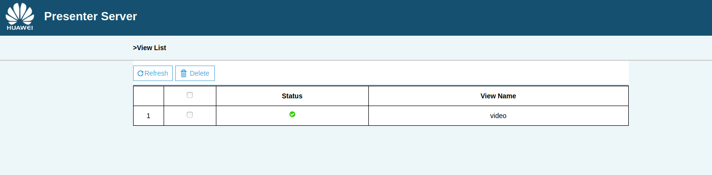

# Body Pose Detection \(Python)

This application runs on Atlas 200 DK, to infer human body poses. For more information on the original Lightweight OpenPose model, please refer to [link](https://github.com/Daniil-Osokin/lightweight-human-pose-estimation.pytorch), an open-source pose detection network. This application can be run on various input formats, namely image input, video input as well as live camera input. 

In this repository, the model is a simplied version for edge computing, and it directly outputs the predicted locations of the human body joints. The set of 14 detected joints are shown in the diagram below:

                     12                     0-right shoulder, 1-right elbow, 2-right wrist, 3-left shoulder
                     |                      4-left elbow, 5-left wrist, 6-right hip, 7-right knee, 8-right ankle
                     |                      9-left hip, 10-left knee, 11-left ankle, 12-top of the head, 13-neck
               0-----13-----3
              /     / \      \
             1     /   \      4
            /     /     \      \
           2     6       9      5
                 |       |
                 7       10
                 |       |
                 8       11

    

The figure below shows the sample output on a single image input. The detected pose is displayed in the form of a skeleton overlay on the image.

**Figure**  Body pose detection result<a name="zh-cn_topic_0228757088_fig64391558352"></a>  
    

Original image from https://www.pexels.com/photo/man-playing-tennis-1407818/

**Performance:** The inference time of running the model on Atlas 200 DK is about 17 ms per image/frame .  
**Limitation:** The model works well when there is only one persion and with whole body clearly shown in the view.

## Software Preparation<a name="zh-cn_topic_0228757083_section17595135641"></a> 

**Note,** The following setup is for the scenario where you have a ubuntu server/PC and Atlas 200 DK setup as [official guide](https://support.huaweicloud.com/intl/en-us/productdesc-A200dk_3000/atlas200_DK_pdes_19_0007.html), and Atlas 200 DK is connected directly with the server/PC with USB or network cable. 

In the server/PC, clone or download the project repository:

**mkdir -p $HOME/AscendProjects**

**cd $HOME/AscendProjects**  

**git clone https://github.com/Atlas200dk/sample_bodypose.git**

OR

**wget https://github.com/Atlas200dk/sample_bodypose.git**   

  
## Environment Preparation<a name="zh-cn_topic_0228757083_section17595135641"></a> 
Make sure required libraries for Python3 environment (OpenCV, Numpy, PresentAgent and other dependencies) have been installed on Atlas 200 DK.
You may first run the application, if there is any error about missing dependency, please refer to https://github.com/Huawei-Ascend/samples/tree/master/common and install.
   

## Environment Deployment<a name="zh-cn_topic_0228757083_section1759513564117"></a>  

1.  Go to the directory where the application code is located, such as: $HOME/AscendProjects/sample_bodypose/. 
     
    **cd $HOME/AscendProjects/sample_bodypose/** 

2.  Modify the configuration file, if you need to view the detection results using presenter server for the live input or video source.  

    Modify **presenter\_server\_ip** and **presenter\_view\_ip** in **body\_pose.conf** to the current ubuntu server and atlas200dk development board network port ip,           **presenter \_agent\_ip** is the ip of the network port connected to the ubuntu server on the development board.

    If you use USB connection, the USB network port ip of the development board is 192.168.1.2, and the network port ip of the virtual network card connected to the ubuntu server and the development board is 192.168.1.223, then the configuration file content is as follows:

    **presenter\_server\_ip=192.168.1.223**

    **presenter\_view\_ip=192.168.1.223**

    **presenter\_agent\_ip=192.168.1.2**

    
    Generally, when connecting via USB, atlas200dk\_board\_ip is the USB network port ip of the development board, and the default is 192.168.1.2. When connecting through a network port, atlas200dk\_board\_ip is the network port ip of the development board, and the default is 192.168.0.2.

3.  Copy the application code to Atlas 200 DK board.
   
    Navigate to the directory where the sample_bodypose application code is located, such as: AscendProjects/sample_bodypose, execute the following command to copy the application code to the development board. If the copy fails, please check if there is a directory HIAI\_PROJECTS on the development board, and if not, create it.

    **scp -r ~/AscendProjects/sample_bodypose HwHiAiUser@192.168.1.2:/home/HwHiAiUser/HIAI\_PROJECTS**

    Enter the development board password when prompted for password. The default password of the development board is **Mind@123**

    
4.  Start Presenter Server, if you need to view the detection results using presenter server for the live input or video source, otherwise, skip this step.

    Execute the following command to start the Presenter Server in the background.

    **bash $HOME/AscendProjects/sample_bodypose/script/run_presenter_server.sh &**

    Log in to the Presenter Server using the prompted URL. The figure below shows that the Presenter Server has started successfully.

    **Figure**  Home Page Display<a name="zh-cn_topic_0228757088_fig64391558352"></a>  


    
    The communication between Presenter Server, Mind Studio and Atlas 200 DK is shown as below：


    **Figure**  Examples of IP addresses<a name="zh-cn_topic_0228757088_fig1881532172010"></a>  


    NOTE:

    -   The IP address used by the Atlas 200 DK developer board is 192.168.1.2 (USB connection).
    -   The IP address for the communication between Presenter Server and Atlas 200 DK is the IP address of the UI Host server on the same network segment as Atlas 200 DK, for example: 192.168.1.223.
    -   This example of the IP address for accessing Presenter Server through a browser is 10.10.0.1. Since Presenter Server and Mind Studio are deployed on the same server, this IP address is also the IP for accessing Mind Studio through a browser.

    
5.  Copy acl.so to the development board. Please skip this step if the file already availabe on Atlas 200 DK directory **/home/HwHiAiUser/Ascend/**.

    **scp ~/Ascend/ascend-toolkit/20.0.RC1/arm64-linux_gcc7.3.0/pyACL/python/site-packages/acl/acl.so HwHiAiUser@192.168.1.2:/home/HwHiAiUser/Ascend/**  

    **Please replace X.X.X with the actual version number of the Ascend-Toolkit development kit package**   
    **For example: the package name of the Toolkit package is Ascend-Toolkit-20.0.RC1-x86_64-linux_gcc7.3.0.run, then the version number of this Toolkit is 20.0.RC1.**


6. Log in to the development board and add environment variables. Please skip this step if it is already done in other projects.

    **ssh HwHiAiUser@192.168.1.2**  
    **vim ~/.bashrc**   
    Add two lines at the end    
    **export LD_LIBRARY_PATH=/home/HwHiAiUser/Ascend/acllib/lib64**   
    **export PYTHONPATH=/home/HwHiAiUser/Ascend/:\\${PYTHONPATH}**  
       

    Execute the following command to make the environment variable take effect
    
    **source ~/.bashrc**  


## Running the Application

1. Log in to the development board. Navigate to the code directory corresponding to the required input source format (image, video or live camera), and execute one of the following commands to run the application according to the input source format. 

    **NOTE**: To execute it, you could use the default input (just run **python3 main.py** without parameter), or input parameters as below for input/output paths and model path as indicated in **main.py**. For the video input, you also have the option to save the output as a video or display to presenter server, with the value in parameter 'is_presenter_server' set to False or True, respectively .

    *Image input source*: 

    **cd ~/HIAI_PROJECTS/sample_bodypose/code_image**   
    **python3 main.py --model='model/body_pose.om' --frames_input_src='tennis_player.jpg' --output_dir='outputs'**

    *Video input source (output video)*:

    **cd ~/HIAI_PROJECTS/sample_bodypose/code_video**   
    **python3 main.py --model='model/body_pose.om' --frames_input_src='yoga.mp4' --output_dir='outputs' --is_presenter_server=False**

    Video input source (output streamed to presenter server)*:

    **cd ~/HIAI_PROJECTS/sample_bodypose/code_video**   
    **python3 main.py --model='model/body_pose.om' --frames_input_src='yoga.mp4' --output_dir='outputs' --is_presenter_server=True**

    *Live camera source*:

    **cd ~/HIAI_PROJECTS/sample_bodypose/code_live**   
    **python3 main.py --model='model/body_pose.om'**
    
    **Note**, for the live camera case, the "CAMERA0" camera is used by default. Please refer to the link below for the viewing method.   
   https://support.huaweicloud.com/usermanual-A200dk_3000/atlas200dk_02_0051.html 
   
   The sample video originates from https://www.pexels.com/video/woman-stretching-near-a-cliff-854370

2.  If you need to view the detection results using presenter server for the live input or video source, log in to the Presenter Server website using the URL that was prompted when the Presenter Server service was started. Otherwise, skip this step.

    Wait for the Presenter Agent to transmit data to the server, and click "Refresh" to refresh. When there is data, the status of the corresponding Channel turns green, as shown in the figure below.

    **Figure**  Presenter Server<a name="zh-cn_topic_0228461904_zh-cn_topic_0203223294_fig113691556202312"></a>  
 

    Click the corresponding View Name link on the right, such as "video" in the above picture, to view the results.

## Stopping Application<a name="zh-cn_topic_0228757088_section1092612277429"></a>

If the presenter server is being used for display, stop 

-   **Stop Presenter Server**

    The Presenter Server service will always be running after it is started. If you want to stop the Presenter Server service corresponding to the pose detection application, you can perform the following operations.

    Execute the following command on the command line on the server where the process of the Presenter Server service is running:
    
    **ps -ef | grep presenter**

    ```
    ascend@ubuntu:~/AscendProjects/sample_bodypose/script$ ps -ef | grep presenter
    ascend 9560 1342 0 02:19 pts/4  00:00:04   python3/home/ascend/AscendProjects/sample_bodypose.bak/script/..//present
    erserver/presenter_server.py --app sample_bodypose
    ```

    As shown above, _9650_ is the process ID of the Presenter Server service corresponding to the sample_bodypose application.

    If you want to stop this service, execute the following command:


    **kill -9** _9650_
